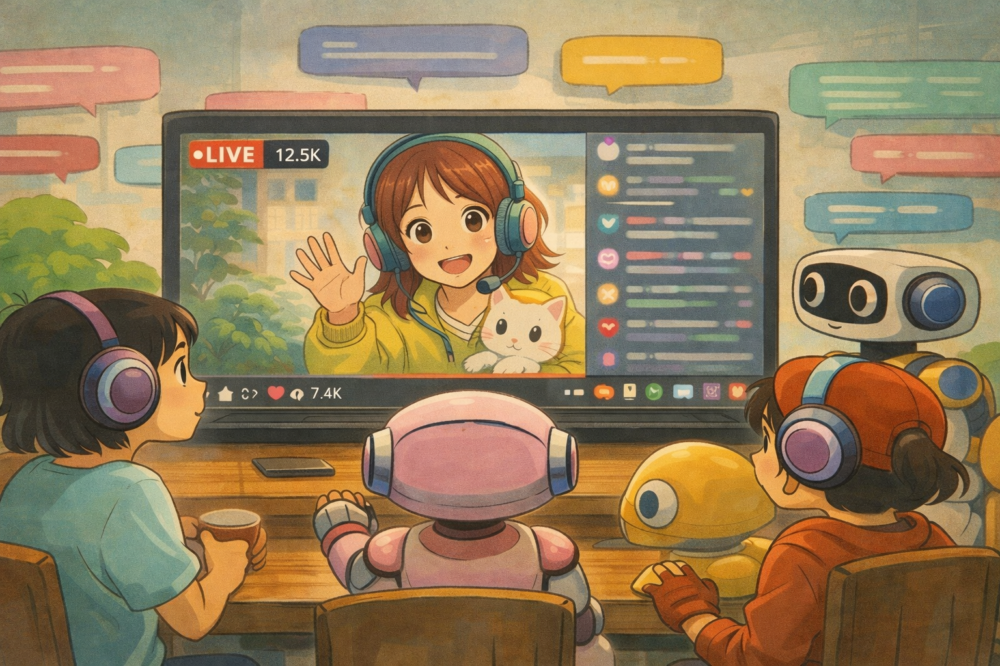

# MM Goober AGI Benchmark Suite



This repository contains the evaluation harness for the **MM Goober** benchmark. It evaluates multimodal Large Language Models (LLMs) on their ability to predict, reconstruct, and adapt to live, dynamic environments (YouTube Live Streams).

## Architecture

The benchmark evaluates models across 10 diverse 24/7 live streams. It produces a **single normalized score (Max: 100)** based on the weighted average of three tasks:

- **Task 1 (30%)**: Future Chat Prediction (BERTScore + ROUGE-L)
- **Task 2 (40%)**: Cognitive Reconstruction / Visual Inference (LLM-as-a-Judge Semantic Evaluation)
- **Task 3 (30%)**: Stream-Switch Adaptation / Context Agility (Zero-Shot LLM Evaluation)

### Files
- `config.py`: Contains the 10 YouTube links and benchmark tuning parameters.
- `stream_fetcher.py`: Connects to `yt-dlp` and `pytchat` to pull synchronized frames (1 FPS) and live chat dynamically.
- `metrics.py`: The evaluation engine using standard ML metrics.
- `benchmark.py`: The core test runner. It iterates through all 10 videos, runs all 3 tasks, performs the "Hard Switch" logic for Task 3, and calculates the final score.

## Installation

Ensure you have system dependencies for OpenCV, then install the Python libraries:

```bash
pip install yt-dlp opencv-python pytchat numpy pillow torch torchvision transformers rouge-score bert-score lpips git+https://github.com/openai/CLIP.git
```

## How to Test Your LLM

To evaluate your own model, open `benchmark.py` and modify the `MockLLMInterface` class.

```python
class MockLLMInterface:
    def predict_future_chat(self, history_frames: List[np.ndarray], history_chat: List[str]) -> List[str]:
        # TODO: Pass the frames and chat to your LLM (e.g., GPT-4V, Gemini Pro)
        # return a list of predicted chat strings
        pass

    def reconstruct_visual_state(self, history_chat: List[str]) -> str:
        # TODO: Pass the withheld chat logs to your multimodal LLM
        # return a detailed text description of what likely happened visually during those 10 seconds.
        pass
```

## Running the Benchmark

Simply execute the main script:

```bash
python benchmark.py
```

At the end of the run (which will take some time as it pulls live data from all 10 streams), you will receive a printout like this:

```text
========================================
🏆 MM GOOBER BENCHMARK RESULTS 🏆
========================================
Task 1 (Future Chat):     85.40 / 100
Task 2 (Cognitive Recon): 72.10 / 100
Task 3 (Context Switch):  90.00 / 100
----------------------------------------
🌟 FINAL AGI SCORE:       81.46 / 100
========================================
```
